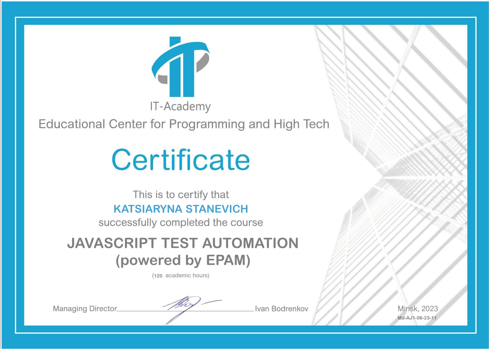

# rsschool-cv
## Katsiaryna Stanevich
### Junior Javascript Engineer in Test

---

## Contact Information
- **Location:** Warsaw, Poland
- **Email:** [ek.stanevich@gmail.com](mailto:ek.stanevich@gmail.com)
- **LinkedIn:** [Ekaterina Stanevich](https://www.linkedin.com/in/ekaterina-stanevich)

---

## Skills
- **Technologies:** Git, JavaScript, TypeScript, HTML
- **Frameworks:** Cypress, WebDriverIO, Cucumber
- **Testing:** Unit, API, e2e
- **CI/CD:** GitHub Actions, Cypress Cloud, Jenkins

---

## Education
- **May 2023 - September 2023**  
  IT Academy, JavaScript QA Automation Engineer  
  Grade: 9.69  
  

- **September 2013 - July 2018**  
  Belarusian National Technical University, Civil Engineer

---

## Projects
- **September 2023:**  
  Developed a framework for automated testing of a marketplace and news site.  
  Technologies used: Cypress, Cypress Cloud, JavaScript, GitHub Actions.  
  [Project Link](https://github.com/katyastan/FinalWork)

---

## Languages
- **English:** B1
- **Russian:** Native
- **Belarusian:** Native
